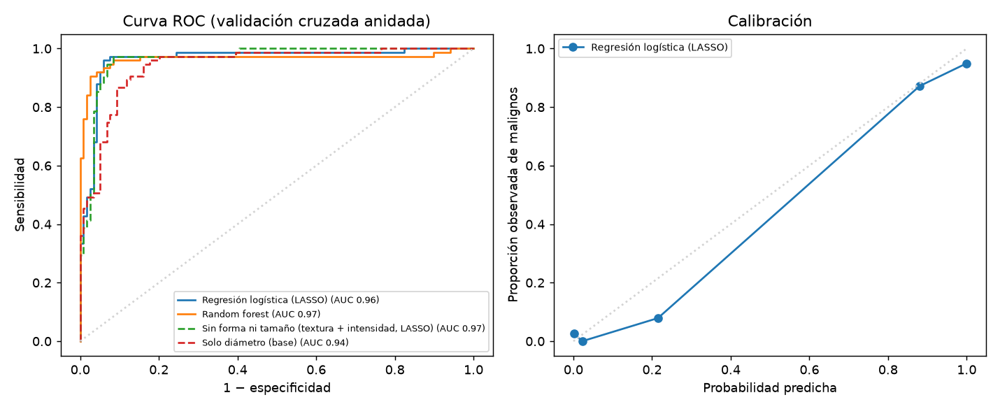
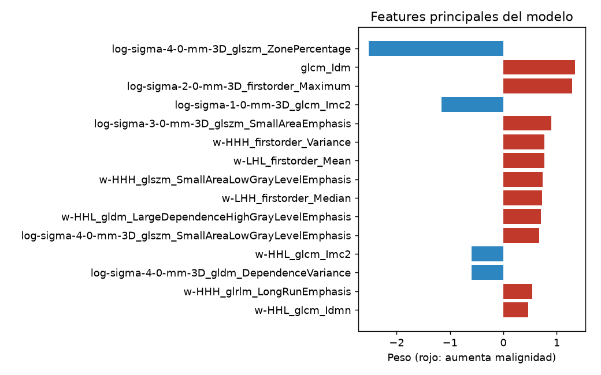

# Validación — modelo benigno / maligno

Generado: 2026-09-28 00:13

## Datos

- LIDC-IDRI: **194 nódulos** de **114 pacientes**.
- Etiqueta: mediana del puntaje de malignidad de los radiólogos (4–5 maligno, 1–2 benigno, 3 excluido).
- Validación cruzada anidada agrupada por paciente (5 folds externos × 5 internos): cada nódulo
  se evalúa una vez con un modelo que nunca vio a su paciente.

## Resultados

| Modelo | AUC global | AUC por fold (media ± DE) | Sensibilidad | Especificidad | Brier |
|---|---|---|---|---|---|
| Regresión logística (LASSO) | 0.964 | 0.960 ± 0.027 | 0.96 | 0.94 | 0.057 |
| Random forest | 0.966 | 0.971 ± 0.031 | 0.92 | 0.95 | 0.050 |
| Sin forma ni tamaño (textura + intensidad, LASSO) | 0.966 | 0.957 ± 0.035 | 0.95 | 0.93 | 0.063 |
| Solo diámetro (base) | 0.943 | 0.947 ± 0.033 | 0.80 | 0.91 | 0.096 |

Umbral de 0,5 para sensibilidad y especificidad. Brier: error de las probabilidades (menor es mejor).

## Modelo elegido: Regresión logística (LASSO)

Se prefiere la regresión logística si su AUC está a menos de 0.01 del mejor
modelo (permite explicar el aporte de cada feature por caso). Reentrenado con todos los nódulos.
Features usadas: **45** de 1.218.

| Feature | Peso |
|---|---|
| `log-sigma-4-0-mm-3D_glszm_ZonePercentage` | -2.525 |
| `original_glcm_Idm` | +1.341 |
| `log-sigma-2-0-mm-3D_firstorder_Maximum` | +1.284 |
| `log-sigma-1-0-mm-3D_glcm_Imc2` | -1.164 |
| `log-sigma-3-0-mm-3D_glszm_SmallAreaEmphasis` | +0.904 |
| `wavelet-HHH_firstorder_Variance` | +0.772 |
| `wavelet-LHL_firstorder_Mean` | +0.766 |
| `wavelet-HHH_glszm_SmallAreaLowGrayLevelEmphasis` | +0.733 |
| `wavelet-LHH_firstorder_Median` | +0.723 |
| `wavelet-HHL_gldm_LargeDependenceHighGrayLevelEmphasis` | +0.701 |
| `log-sigma-4-0-mm-3D_glszm_SmallAreaLowGrayLevelEmphasis` | +0.676 |
| `wavelet-HHL_glcm_Imc2` | -0.599 |
| `log-sigma-4-0-mm-3D_gldm_DependenceVariance` | -0.597 |
| `wavelet-HHH_glrlm_LongRunEmphasis` | +0.536 |
| `wavelet-HHL_glcm_Idmn` | +0.462 |

## Limitaciones

- La etiqueta es opinión radiológica, no anatomía patológica.
- En LIDC-IDRI el puntaje de malignidad está muy asociado al tamaño; por eso se compara contra un modelo que usa solo el diámetro.
- Conjunto chico (194 nódulos): las métricas tienen incertidumbre amplia.
- Datos de un único dataset público: requiere validación externa antes de cualquier uso con datos propios.
- Uso académico: no es una herramienta diagnóstica.
